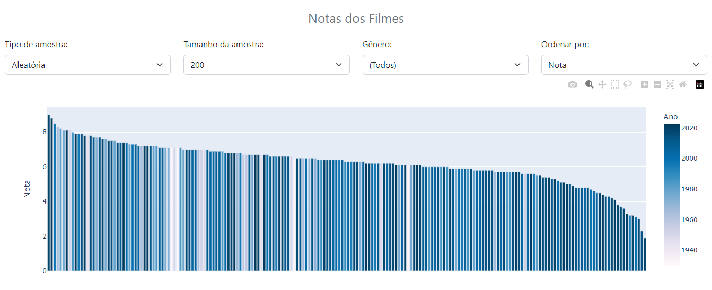
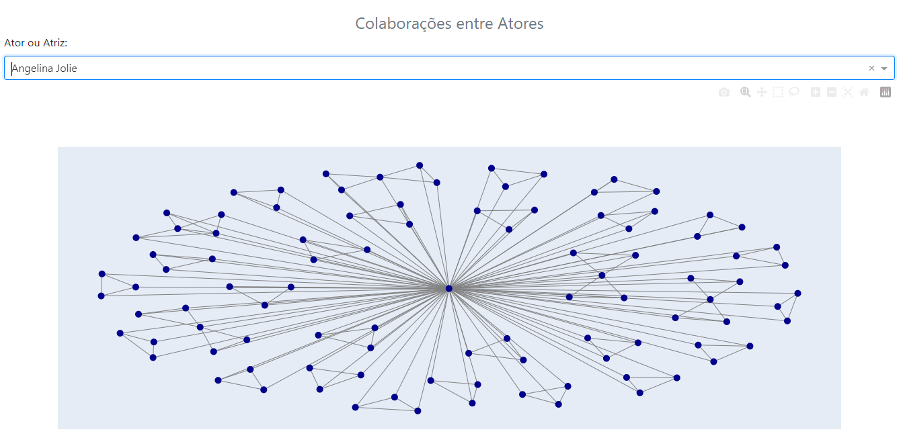
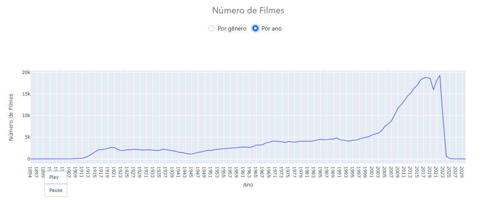
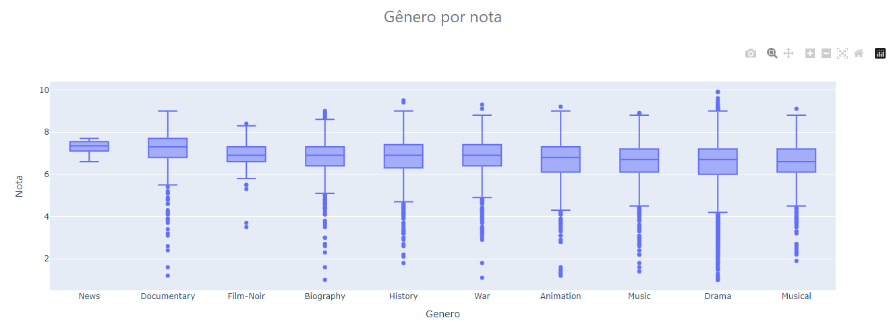

<h1 align="center"> Visualização IMBD </h1>

## Descrição

O aplicativo web [IMBD Data Visualization](https://imdb-visualization.onrender.com) conta com visualizações interativas para os dados do Internet Movie Database (IMDB), que é uma base de dados online de informação sobre filmes, séries, TV, música e games. As visualizações criadas focam no tipo "Filme", através das quais é possível explorar o ranking de filmes pela nota, os grafos de conexão entre atores que colaboraram em filmes e a distribuição de filmes por gênero e ano.

O aplicativo foi desenvolvido através do framework Dash, os dados foram amazenados em um banco de dados MongoDB Cloud e a hospedagem feita pelo Render.

## Pré-visualização

1. Nota dos filmes

Nessa visualização é possível observar a distribuição dos filmes pela nota e pelo ano. Cada barra representa um filme e sua cor representa seu ano de lançamento. Informações sobre um filme são dadas ao passar o mouse por cima da barra. Além disso, é possível filtrar pelo número de filmes mostrados no gráfico, pelo gênero e ordenar pela nota, ano ou ambos.

2. Conexões entre atores

Cada vértice do grafo de conexões representa um ator e uma aresta entre dois vértices representa um filme em que os dois atores colaboraram. É possível filtrar procurando o nome de um ator específico para mostrar suas conexões. Ao passar o mouse por cima dos vértices, é mostrado o nome do ator e ao passar o mouse pela aresta é mostrado o nome do filme.

3. Distribuição de filmes por gênero e ano

É possível visualizar a quantidade de filmes por gênero e por ano, para observar o aumento no número de produções desse tipo ao longo dos anos. Essa visualização também conta com uma animação.

4. Boxplot

Um boxplot que mostra a variação das notas dos filmes por gênero.

